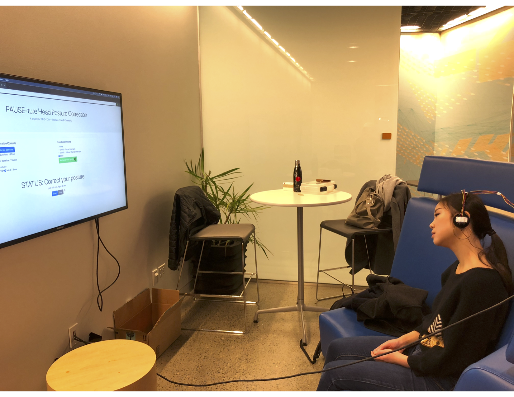
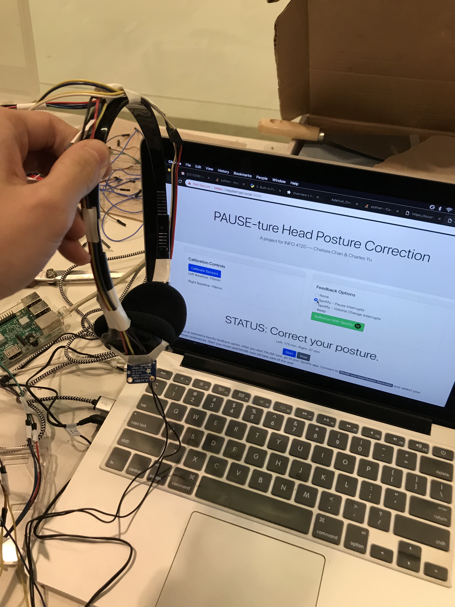
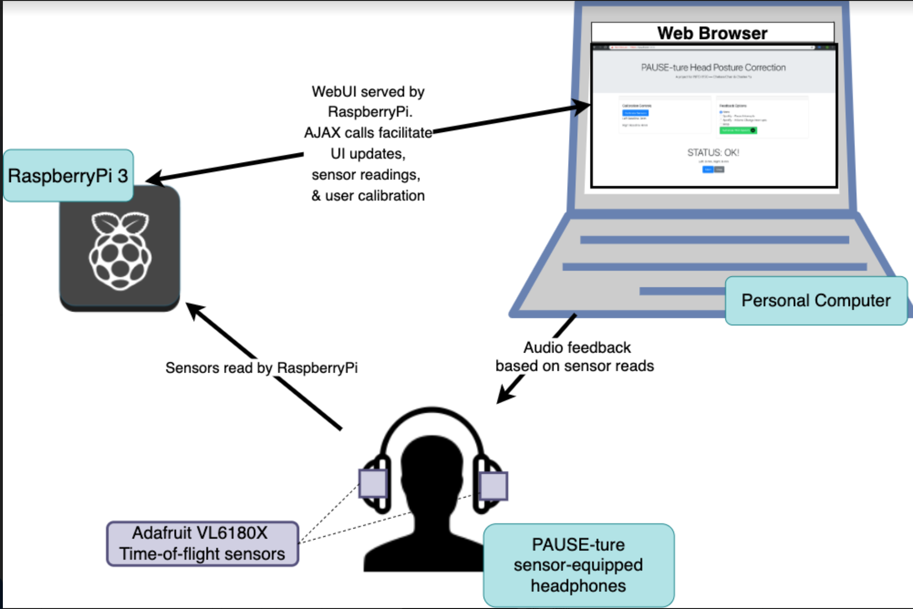

# PAUSE-ture-Head-Posture-Correction

Code repository for the protoype PAUSE-ture Head Posture Correction system, a project for INFO 4120 (Ubiquitious Computing).
The PAUSE-ture system is served off a Raspberry Pi that connects to sensor-equipped pair of headphones. A user can interact with
the system by navigating to `https://raspberrypi.local:5000` in their browser.

For more information, see the writeup PDF included in this repo.





## Requirements

### Hardware specs for running right out of the box
- 1 x Raspberry Pi 3
- 1 x Adafruit TCA9548A 1-to-8 I2C Multiplexer
- 2 x Adafruit VL6180X Time of Flight Micro-LIDAR Distance Sensor
- 1 x Headphones
- 1 x Personal Computer

### Installation & Set-Up Instructions:
1. Pull this respository onto your Raspberry Pi. 
2. Configure a `config.ini` file (see **Configuration** section below).
3. Make sure you have enabled I2C and that the Raspberry Pi is connected to the same local network as your user's device.
4. Install dependencies with `pip install -r rpi-requirements.txt` (Python3)
5. Wire up your Time-of-Flight sensors to the I2C Multiplexer. **To work out of the box, the right sensor should be wired to channel 0; the left should be wired to channel 2.**
6. Start the application server with `python app.py` (Python3) on the Raspberry Pi. 
7. You should now be able to connect to the system by going to `https://raspberrypi.local:5000` in your desired browser.

### Configuration
You must create a `config.ini` file located in the project root to run this app. The format is of the following:
```
# config.ini
[DEFAULT]
SPOTIFY_CLIENT_ID = <YOUR-SPOTIFY-CLIENT-ID-HERE>
SPOTIFY_CLIENT_SECRET = <YOUR-SPOTIFY-CLIENT-SECRET-HERE>
IS_RPI_SERVER = <`1` FOR RAPSBERRYPI | `0` FOR NONRPI>
```

Note:
This repository contains certain artifacts that allow for mocked development 
on a non-Raspberry Pi device or for production on a Raspberry Pi. You can set the mode via the `config.ini file`. 
**NOTE: The mocked development environment requires you to run `pip install -r requirements.txt` (Python3) to get the right dependencies**

## Architecture Digram



## Organization 
```
├── app.py                        # The flask app that serves the UI
├── requirements.txt              # Non-RPI requirements
├── rpi-requirements.txt          # RPI requirements
├── sensor.py                     # conducts sensor reads from hardware
├── static
│   └── css
│       └── main.css              # styling for WebUI
└── templates
    ├── index.html                # web UI
    └── js
        ├── sensor-read.js        # Facilitates requests to server for sensor reads & UI response
        └── spotify-maker.js      # Facilitates Spotify Authorization
 ```

